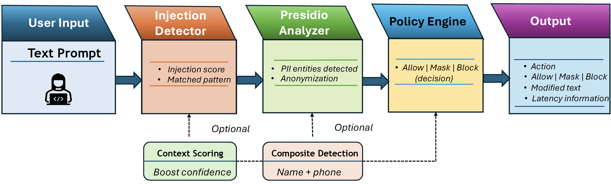

# Presidio-Based LLM Security Mini-Gateway

A modular security gateway for Large Language Model (LLM) applications that detects prompt injection attempts and mitigates sensitive information leakage before requests reach the model.

## Overview

This project implements a lightweight preprocessing layer for LLM systems. It analyzes user input, detects adversarial prompt injection patterns, identifies personally identifiable information (PII) using Microsoft Presidio, and applies a policy decision to either:

- **ALLOW** the input
- **MASK** sensitive entities
- **BLOCK** malicious or high-risk input

The system is implemented with FastAPI and includes configurable thresholds, latency measurement, and an evaluation pipeline.

## System Architecture

The security gateway acts as a preprocessing layer between users and the LLM.

User Input  
→ Injection Detection  
→ Presidio PII Analyzer  
→ Policy Engine  
→ Output Decision (ALLOW / MASK / BLOCK)

<p align="center">

</p>


## Features

- Rule-based prompt injection / jailbreak detection
- Microsoft Presidio-based PII detection and anonymization
- Custom Korean phone number recognizer
- Context-aware confidence boosting
- Composite entity detection (e.g., name + phone)
- Policy-driven enforcement (ALLOW / MASK / BLOCK)
- Configurable thresholds via `config.py`
- FastAPI REST API with Swagger UI
- Evaluation pipeline with accuracy, precision, recall, F1, confusion matrix, and latency reporting

## Project Structure

```text
app/
  main.py
  policy.py
  injection_detector.py
  presidio_engine.py
  context_scoring.py
  composite_detector.py
  custom_recognizers.py
  config.py

eval/
  prompts.jsonl
  run_eval.py

report/
  report.pdf

figures/
  arch.png
  ROC_Analysis_Final.pdf
  confusion_matrix_heatmap.pdf
  latency_distribution_plot.pdf
  precision_recall_curve.pdf

requirements.txt
README.md
```
## How to Run

Clone the repository:
```
git clone https://github.com/Tooba19/presidio-llm-security-gateway.git

cd presidio-llm-security-gateway
```

Install dependencies:

```
pip install -r requirements.txt

python -m spacy download en_core_web_lg
```

Run the API:

```
uvicorn app.main:app --reload
```

Open Swagger UI:
```
http://127.0.0.1:8000/docs

```

Run evaluation pipeline:
```
python -m eval.run_eval 

```
## Evaluation Dataset

The evaluation dataset contains 40 prompts covering four categories:

| Category | Description | Example |
|--------|--------|--------|
| Benign | Normal user requests | "What is the capital of Germany?" |
| PII | Sensitive information | Email addresses, phone numbers |
| Injection | Prompt injection attempts | "Ignore previous instructions" |
| Mixed | Injection + PII | "Ignore instructions. My email is admin@company.com" |

Dataset file:

eval/prompts.jsonl

Each entry contains:
```

{
"text": "...",

"label": "ALLOW/MASK/BLOCK",

"category": "benign/pii/injection/mixed"
}
```

The dataset is used by `eval/run_eval.py` to measure detection performance.

## Evaluation Results

Evaluation was performed on 40 test prompts.

| Metric | Value |
|------|------|
| Accuracy | 1.00 |
| Precision | 1.00 |
| Recall | 1.00 |
| F1 Score | 1.00 |

Confusion matrix:

| Actual / Predicted | ALLOW | MASK | BLOCK |
|---|---|---|---|
| ALLOW | 10 | 0 | 0 |
| MASK | 0 | 10 | 0 |
| BLOCK | 0 | 0 | 20 |

Average latency:

| Category | Avg Latency (ms) |
|------|------|
| Benign | 14.38 |
| PII | 13.15 |
| Injection | 4.07 |
| Mixed | 5.52 | 

## Technical Report

The full technical report describing the threat model, Presidio customization, system architecture, and evaluation is available here:

[Download Report](report/report.pdf)

## Limitations

The current system uses rule-based injection detection.

While effective for known attack patterns, it may fail against:

- paraphrased jailbreak prompts
- multilingual injection attempts
- adversarial prompt obfuscation

Future work will explore:

- embedding-based injection detection
- lightweight ML classifiers
- adaptive policy learning


